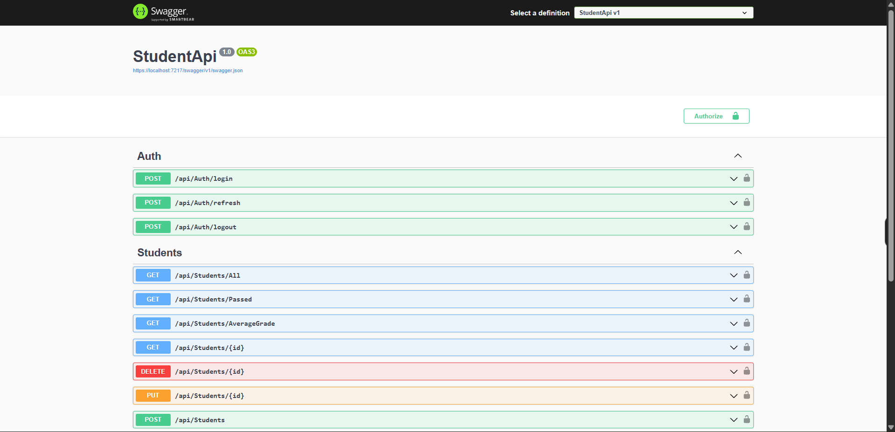

# 🛡️ ASP.NET Core API Security Practice

## 📌 Project Overview

This repository is a hands-on API security engineering project built with ASP.NET Core. It demonstrates how an intentionally simple public API can be hardened step by step into a secure API using practical controls, not theory alone.

The focus is security implementation: authentication, authorization, session handling, abuse prevention, and security logging. The project intentionally avoids database, UI, and business-layer complexity so the security architecture stays clear and reviewable.

## 🎯 Why This Project Exists

Most sample APIs stop at CRUD functionality. This project focuses on what matters in real back-end systems:

- enforcing least privilege
- preventing horizontal privilege escalation
- securing token lifecycle and logout
- reducing brute-force and abuse risk
- creating auditable security events

## 🔄 From Public API to Secure API

The repository contains two implementations of the same student API concept:

| Project | Purpose |
|---|---|
| `StudentPublicAPI` | Baseline public API with no authentication/authorization layer |
| `SecureStudentAPI` | Security-focused implementation with multiple protection layers |

## 📷 Runtime Swagger View

The following screenshot shows the API running in Swagger with all available endpoints:



## 🔐 Security Features Implemented

The following controls are implemented in `SecureStudentAPI`:

1. **HTTPS enforcement** via `UseHttpsRedirection()`
2. **CORS** with configured allowed origins and global middleware application
3. **JWT authentication** (issuer, audience, lifetime, signature validation)
4. **Role-based authorization** (`Admin`, `Student`)
5. **Ownership policy** (`StudentOwnerOrAdmin`) for resource-level access control
6. **Refresh token flow** with hashed server-side storage and expiry
7. **Logout revocation** (`RefreshTokenRevokedAt`)
8. **Refresh token rotation** on successful refresh
9. **IP-based rate limiting** for auth endpoints (`5 requests/minute`)
10. **Security-focused logging and auditing** for authentication, authorization, token usage, and privileged actions

## 🧾 Authentication and Authorization Model

`AuthController` issues JWT access tokens with `NameIdentifier`, `Email`, and `Role` claims after credential verification.

- **Admin** has elevated access to privileged endpoints such as full list access and mutations.
- **Student** is constrained by ownership rules on protected resources.
- The secure controller is protected at class level with `[Authorize]`, with explicit `[AllowAnonymous]` only where intended.

## 👤 Ownership-Based Access Control

Resource ownership is enforced through a custom policy:

- `StudentOwnerOrAdminRequirement`
- `StudentOwnerOrAdminHandler`

For `GET /api/Students/{id}`, authorization succeeds only when:

1. the caller is an `Admin`, or
2. the caller's `NameIdentifier` matches the target student ID.

This directly mitigates horizontal privilege escalation attempts between student accounts.

## 🔄 Secure Session Management

Refresh token handling in `AuthController` follows a security-oriented lifecycle:

1. A cryptographically random refresh token is generated.
2. Only the **hash** is stored server-side.
3. Expiry is tracked (`RefreshTokenExpiresAt`).
4. Logout revokes refresh capability (`RefreshTokenRevokedAt`).
5. Successful refresh rotates the token and invalidates previous token material.

Access tokens are short-lived (30 minutes) and refresh tokens are longer-lived (7 days), balancing UX and risk.

## 🚦 Rate Limiting

Auth-sensitive endpoints (`/api/Auth/login`, `/api/Auth/refresh`) are protected with a fixed-window limiter:

- key: client IP
- limit: **5 requests per minute**
- queue: disabled
- rejection: HTTP `429 Too Many Requests`

This reduces brute-force and token abuse surface.

## 📝 Logging and Auditing

Security-relevant events are intentionally logged, including:

- failed login attempts (unknown email / invalid password)
- invalid refresh attempts (unknown email, revoked token, expired token, invalid token)
- successful login and refresh events
- global forbidden (`403`) access attempts (with user ID, path, IP)
- privileged admin delete action attempts and outcomes

These logs provide operational visibility and incident investigation value.

## 🗂️ Project Structure

```text
ASP.NET-Core-API-Security-Practice
|-- StudentPublicAPI/          # Insecure baseline API
|-- SecureStudentAPI/          # Secured API implementation
|   |-- Authorization/         # Custom ownership policy + handler
|   |-- Controllers/           # Auth and student endpoints
|   |-- DTOs/Auth/             # Login/refresh/logout contracts
|   |-- DataSimulation/        # In-memory users/students
|   `-- Model/                 # Student model with auth/token fields
`-- README.md
```

## 🧠 Key Security Concepts Learned

- Defense in depth in ASP.NET Core middleware and endpoint design
- JWT claim design and validation boundaries
- Least-privilege endpoint protection with role and ownership policies
- Horizontal access control prevention for user-owned resources
- Refresh token security (hashing, revocation, rotation)
- Abuse mitigation through endpoint-level rate limiting
- Building actionable security telemetry through structured logs

## 🌟 Why This Project Stands Out

This is not a CRUD showcase. It is a practical security engineering portfolio project that demonstrates implementation-level understanding of API protection patterns and tradeoffs in a realistic ASP.NET Core codebase.

It is intentionally simple in domain and storage so reviewers can focus on security decisions, control layering, and authorization correctness.

## ▶️ How to Run

### 🧪 Public baseline API

```bash
dotnet run --project .\StudentPublicAPI\StudentPublicAPI.csproj
```

Swagger launches from the configured development profile (see `StudentPublicAPI/Properties/launchSettings.json`).

### 🔒 Secure API

```bash
dotnet run --project .\SecureStudentAPI\StudentApi.csproj
```

Swagger launches from the configured development profile (see `SecureStudentAPI/Properties/launchSettings.json`).

### 👥 Test users (from in-memory simulation)

| Role | Email | Password |
|---|---|---|
| Student | `ali.ahmed@student.com` | `password1` |
| Student | `fadi.khail@student.com` | `password2` |
| Student | `ola.jaber@student.com` | `password3` |
| Admin | `alia.maher@admin.com` | `admin123` |
